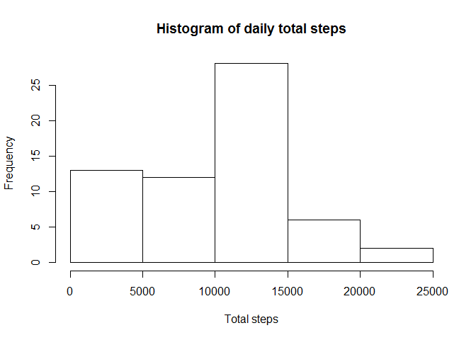
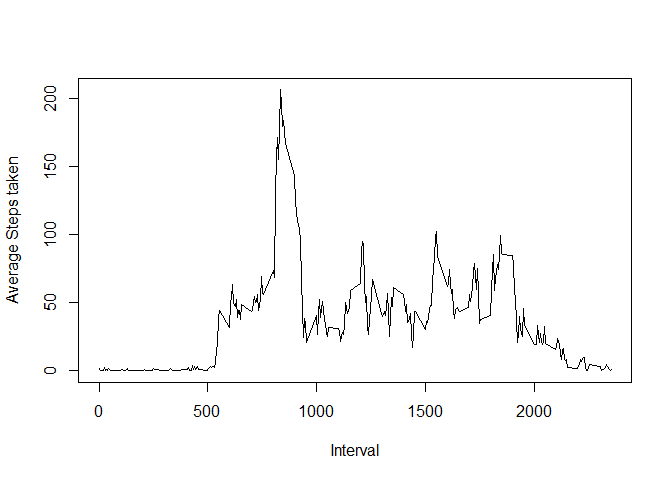
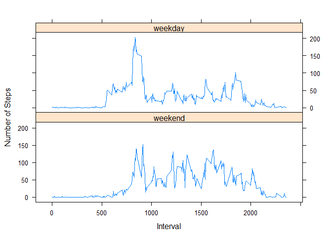

Reading Acitivty Data \[file should be in current working directory\]
---------------------------------------------------------------------

            ActivityData <- read.csv("activity.csv", header = TRUE)

Total number of steps taken per day
-----------------------------------

            DailySteps <- aggregate(ActivityData[,1], list(sum = ActivityData$date), sum, na.rm = TRUE)

Histogram of daily total steps
------------------------------

            hist(DailySteps$x ,main = "Histogram of daily total steps" , xlab = "Total steps")

Mean of the total number of steps taken per day
-----------------------------------------------

            tapply(ActivityData$steps, ActivityData$date, mean ,na.rm = TRUE)

    ## 2012-10-01 2012-10-02 2012-10-03 2012-10-04 2012-10-05 2012-10-06 
    ##        NaN  0.4375000 39.4166667 42.0694444 46.1597222 53.5416667 
    ## 2012-10-07 2012-10-08 2012-10-09 2012-10-10 2012-10-11 2012-10-12 
    ## 38.2465278        NaN 44.4826389 34.3750000 35.7777778 60.3541667 
    ## 2012-10-13 2012-10-14 2012-10-15 2012-10-16 2012-10-17 2012-10-18 
    ## 43.1458333 52.4236111 35.2048611 52.3750000 46.7083333 34.9166667 
    ## 2012-10-19 2012-10-20 2012-10-21 2012-10-22 2012-10-23 2012-10-24 
    ## 41.0729167 36.0937500 30.6284722 46.7361111 30.9652778 29.0104167 
    ## 2012-10-25 2012-10-26 2012-10-27 2012-10-28 2012-10-29 2012-10-30 
    ##  8.6527778 23.5347222 35.1354167 39.7847222 17.4236111 34.0937500 
    ## 2012-10-31 2012-11-01 2012-11-02 2012-11-03 2012-11-04 2012-11-05 
    ## 53.5208333        NaN 36.8055556 36.7048611        NaN 36.2465278 
    ## 2012-11-06 2012-11-07 2012-11-08 2012-11-09 2012-11-10 2012-11-11 
    ## 28.9375000 44.7326389 11.1770833        NaN        NaN 43.7777778 
    ## 2012-11-12 2012-11-13 2012-11-14 2012-11-15 2012-11-16 2012-11-17 
    ## 37.3784722 25.4722222        NaN  0.1423611 18.8923611 49.7881944 
    ## 2012-11-18 2012-11-19 2012-11-20 2012-11-21 2012-11-22 2012-11-23 
    ## 52.4652778 30.6979167 15.5277778 44.3993056 70.9270833 73.5902778 
    ## 2012-11-24 2012-11-25 2012-11-26 2012-11-27 2012-11-28 2012-11-29 
    ## 50.2708333 41.0902778 38.7569444 47.3819444 35.3576389 24.4687500 
    ## 2012-11-30 
    ##        NaN

Median of the total number of steps taken per day
-------------------------------------------------

            tapply(ActivityData$steps, ActivityData$date, median, na.rm = TRUE)

    ## 2012-10-01 2012-10-02 2012-10-03 2012-10-04 2012-10-05 2012-10-06 
    ##         NA          0          0          0          0          0 
    ## 2012-10-07 2012-10-08 2012-10-09 2012-10-10 2012-10-11 2012-10-12 
    ##          0         NA          0          0          0          0 
    ## 2012-10-13 2012-10-14 2012-10-15 2012-10-16 2012-10-17 2012-10-18 
    ##          0          0          0          0          0          0 
    ## 2012-10-19 2012-10-20 2012-10-21 2012-10-22 2012-10-23 2012-10-24 
    ##          0          0          0          0          0          0 
    ## 2012-10-25 2012-10-26 2012-10-27 2012-10-28 2012-10-29 2012-10-30 
    ##          0          0          0          0          0          0 
    ## 2012-10-31 2012-11-01 2012-11-02 2012-11-03 2012-11-04 2012-11-05 
    ##          0         NA          0          0         NA          0 
    ## 2012-11-06 2012-11-07 2012-11-08 2012-11-09 2012-11-10 2012-11-11 
    ##          0          0          0         NA         NA          0 
    ## 2012-11-12 2012-11-13 2012-11-14 2012-11-15 2012-11-16 2012-11-17 
    ##          0          0         NA          0          0          0 
    ## 2012-11-18 2012-11-19 2012-11-20 2012-11-21 2012-11-22 2012-11-23 
    ##          0          0          0          0          0          0 
    ## 2012-11-24 2012-11-25 2012-11-26 2012-11-27 2012-11-28 2012-11-29 
    ##          0          0          0          0          0          0 
    ## 2012-11-30 
    ##         NA

Average daily activity pattern
------------------------------

            FiveMinAvg <- aggregate(ActivityData[,1], list(Interval = ActivityData$interval), mean, na.rm = TRUE)
          
            plot(x ~ Interval, FiveMinAvg , type = "l" , ylab = "Average Steps taken" )

Interval that contains the maximum number of steps
==================================================

            FiveMinAvg[which.max(FiveMinAvg$x), ]

    ##     Interval        x
    ## 104      835 206.1698

Total number of missing values
------------------------------

            sum(is.na(ActivityData$steps))

    ## [1] 2304

Imputing missing values
-----------------------

            require(plyr)

    ## Loading required package: plyr

            require(Hmisc)

    ## Loading required package: Hmisc

    ## Loading required package: lattice

    ## Loading required package: survival

    ## Loading required package: Formula

    ## Loading required package: ggplot2

    ## 
    ## Attaching package: 'Hmisc'

    ## The following objects are masked from 'package:plyr':
    ## 
    ##     is.discrete, summarize

    ## The following objects are masked from 'package:base':
    ## 
    ##     format.pval, round.POSIXt, trunc.POSIXt, units

            imputeValue <- FiveMinAvg[which(FiveMinAvg$Interval == 5), ]
            ActivityData$new <- with(ActivityData, impute(steps, imputeValue$x))
            NewActivityData <- data.frame(ActivityData$new, ActivityData$date, ActivityData$interval)
            colnames(NewActivityData) <- c("steps", "date", "interval")       

Total number of steps taken per day after imputing missing values
-----------------------------------------------------------------

            NewDailySteps <- aggregate(NewActivityData[,1], list(sum = NewActivityData$date), sum, na.rm = TRUE)

Histogram of daily total steps after imputing missing values
------------------------------------------------------------

            hist(NewDailySteps$x, main = "Histogram of daily total steps" , xlab = "Total steps")

Mean after imputing missing values
----------------------------------

            tapply(NewActivityData$steps, NewActivityData$date, mean ,na.rm = TRUE)

    ## 2012-10-01 2012-10-02 2012-10-03 2012-10-04 2012-10-05 2012-10-06 
    ##  0.3396226  0.4375000 39.4166667 42.0694444 46.1597222 53.5416667 
    ## 2012-10-07 2012-10-08 2012-10-09 2012-10-10 2012-10-11 2012-10-12 
    ## 38.2465278  0.3396226 44.4826389 34.3750000 35.7777778 60.3541667 
    ## 2012-10-13 2012-10-14 2012-10-15 2012-10-16 2012-10-17 2012-10-18 
    ## 43.1458333 52.4236111 35.2048611 52.3750000 46.7083333 34.9166667 
    ## 2012-10-19 2012-10-20 2012-10-21 2012-10-22 2012-10-23 2012-10-24 
    ## 41.0729167 36.0937500 30.6284722 46.7361111 30.9652778 29.0104167 
    ## 2012-10-25 2012-10-26 2012-10-27 2012-10-28 2012-10-29 2012-10-30 
    ##  8.6527778 23.5347222 35.1354167 39.7847222 17.4236111 34.0937500 
    ## 2012-10-31 2012-11-01 2012-11-02 2012-11-03 2012-11-04 2012-11-05 
    ## 53.5208333  0.3396226 36.8055556 36.7048611  0.3396226 36.2465278 
    ## 2012-11-06 2012-11-07 2012-11-08 2012-11-09 2012-11-10 2012-11-11 
    ## 28.9375000 44.7326389 11.1770833  0.3396226  0.3396226 43.7777778 
    ## 2012-11-12 2012-11-13 2012-11-14 2012-11-15 2012-11-16 2012-11-17 
    ## 37.3784722 25.4722222  0.3396226  0.1423611 18.8923611 49.7881944 
    ## 2012-11-18 2012-11-19 2012-11-20 2012-11-21 2012-11-22 2012-11-23 
    ## 52.4652778 30.6979167 15.5277778 44.3993056 70.9270833 73.5902778 
    ## 2012-11-24 2012-11-25 2012-11-26 2012-11-27 2012-11-28 2012-11-29 
    ## 50.2708333 41.0902778 38.7569444 47.3819444 35.3576389 24.4687500 
    ## 2012-11-30 
    ##  0.3396226

Median after imputing missing values
------------------------------------

            tapply(NewActivityData$steps, NewActivityData$date, median, na.rm = TRUE)

    ## 2012-10-01 2012-10-02 2012-10-03 2012-10-04 2012-10-05 2012-10-06 
    ##  0.3396226  0.0000000  0.0000000  0.0000000  0.0000000  0.0000000 
    ## 2012-10-07 2012-10-08 2012-10-09 2012-10-10 2012-10-11 2012-10-12 
    ##  0.0000000  0.3396226  0.0000000  0.0000000  0.0000000  0.0000000 
    ## 2012-10-13 2012-10-14 2012-10-15 2012-10-16 2012-10-17 2012-10-18 
    ##  0.0000000  0.0000000  0.0000000  0.0000000  0.0000000  0.0000000 
    ## 2012-10-19 2012-10-20 2012-10-21 2012-10-22 2012-10-23 2012-10-24 
    ##  0.0000000  0.0000000  0.0000000  0.0000000  0.0000000  0.0000000 
    ## 2012-10-25 2012-10-26 2012-10-27 2012-10-28 2012-10-29 2012-10-30 
    ##  0.0000000  0.0000000  0.0000000  0.0000000  0.0000000  0.0000000 
    ## 2012-10-31 2012-11-01 2012-11-02 2012-11-03 2012-11-04 2012-11-05 
    ##  0.0000000  0.3396226  0.0000000  0.0000000  0.3396226  0.0000000 
    ## 2012-11-06 2012-11-07 2012-11-08 2012-11-09 2012-11-10 2012-11-11 
    ##  0.0000000  0.0000000  0.0000000  0.3396226  0.3396226  0.0000000 
    ## 2012-11-12 2012-11-13 2012-11-14 2012-11-15 2012-11-16 2012-11-17 
    ##  0.0000000  0.0000000  0.3396226  0.0000000  0.0000000  0.0000000 
    ## 2012-11-18 2012-11-19 2012-11-20 2012-11-21 2012-11-22 2012-11-23 
    ##  0.0000000  0.0000000  0.0000000  0.0000000  0.0000000  0.0000000 
    ## 2012-11-24 2012-11-25 2012-11-26 2012-11-27 2012-11-28 2012-11-29 
    ##  0.0000000  0.0000000  0.0000000  0.0000000  0.0000000  0.0000000 
    ## 2012-11-30 
    ##  0.3396226

Activity patterns between weekdays and weekends
-----------------------------------------------

            NewActivityData$date <- as.Date(NewActivityData$date)
           #create a vector of weekdays
           weekdays1 <- c('Monday', 'Tuesday', 'Wednesday', 'Thursday', 'Friday')
      
           NewActivityData$wDay <- factor((weekdays(NewActivityData$date) %in% weekdays1),levels=c(FALSE, TRUE), labels=c('weekend', 'weekday'))

         WeekDataset <- aggregate(NewActivityData[,1] , list(ActivityData$interval, NewActivityData$wDay), mean )
         colnames(WeekDataset) <- c("interval", "date", "avg") 
         xyplot(avg~interval|factor(date), data=WeekDataset,  type='l',layout=c(1,2), xlab='Interval',ylab='Number of Steps')

